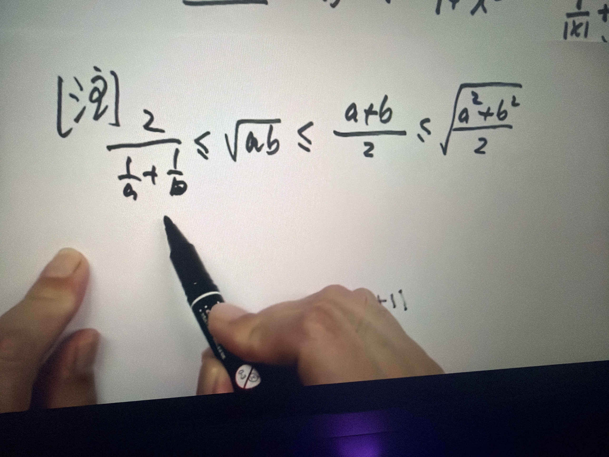

# 知识点 02：均值不等式链（HMGQ）

- 章节：不等式 / 均值不等式
- 日期：2026-10-02
- 来源：网课板书（手写）

## 原图

## 核心结论

对 $a,b>0$：

$$\frac{2}{\frac1a+\frac1b}\ \le\ \sqrt{ab}\ \le\ \frac{a+b}{2}\ \le\ \sqrt{\frac{a^2+b^2}{2}}$$

即 **调和平均 H ≤ 几何平均 G ≤ 算术平均 A ≤ 平方平均 Q**（简称 **调几算平**）。

| 名称 | 记号 | 表达式 |
|---|---|---|
| 调和平均 Harmonic | H | $\dfrac{2}{\frac1a+\frac1b}=\dfrac{2ab}{a+b}$ |
| 几何平均 Geometric | G | $\sqrt{ab}$ |
| 算术平均 Arithmetic | A | $\dfrac{a+b}{2}$ |
| 平方平均 Quadratic | Q | $\sqrt{\dfrac{a^2+b^2}{2}}$ |

## 随手记法（怎么才能不忘）

1. **含义映射**：H=Harmonic 调和、G=Geometric 几何、A=Arithmetic 算术、Q=Quadratic 平方。
2. **运算暴力程度递增**：取倒数 → 开方 → 直接平均 → 先平方再开方。**运算越暴力，越放大数字，结果越大** → H < G < A < Q。这是最稳的一条。
3. **数值验证保命**：代 $a=1,\ b=4$ → H=1.6，G=2，A=2.5，Q=√8.5≈2.9，得 1.6 < 2 < 2.5 < 2.9。考场上忘了就现场代，30 秒。
4. **图像直觉**：固定 $a+b$ 时矩形越接近正方形面积越大（AM ≥ GM）；H 对小数敏感（一个数→0，H→0），永远最小；Q 放大数，最靠右。**"小数字吃亏的在左，大数字占便宜的往右。"**

> ⚠️ **避坑（易混）**：不要用"字母表顺序"记！字母表顺序是 A < G < H < Q，与 H < G < A < Q 完全对不上，纯属误导。也别用英文单词长度记（Harmonic 8 字母、Geometric 9、Arithmetic 10、Quadratic 9，Q 比 A 短，同样对不上）。

## 使用条件（丢分重灾区）

1. **必须 $a,b>0$**（H、G 要求正数）。
2. **等号成立条件一律是 $a=b$**，此时四个均值**同时取等**且都等于 $a$。考试高频考点。
3. **n 元推广**（$a_i>0$）：

$$\frac{n}{\sum_{i=1}^n \frac1{a_i}}\ \le\ \sqrt[n]{\prod_{i=1}^n a_i}\ \le\ \frac{\sum_{i=1}^n a_i}{n}\ \le\ \sqrt{\frac{\sum_{i=1}^n a_i^2}{n}}$$

## 一句话提醒

**"调几算平，越调越小"；顺手代 1 和 4 验一遍。别信任何'字母表顺序'的鬼话。**

minis_url: minis://workspace/vault/%E9%94%99%E9%A2%98%E5%BA%93/%E9%AB%98%E6%95%B0/%E7%9F%A5%E8%AF%86%E7%82%B902_%E5%9D%87%E5%80%BC%E4%B8%8D%E7%AD%89%E5%BC%8F%E9%93%BE.md
