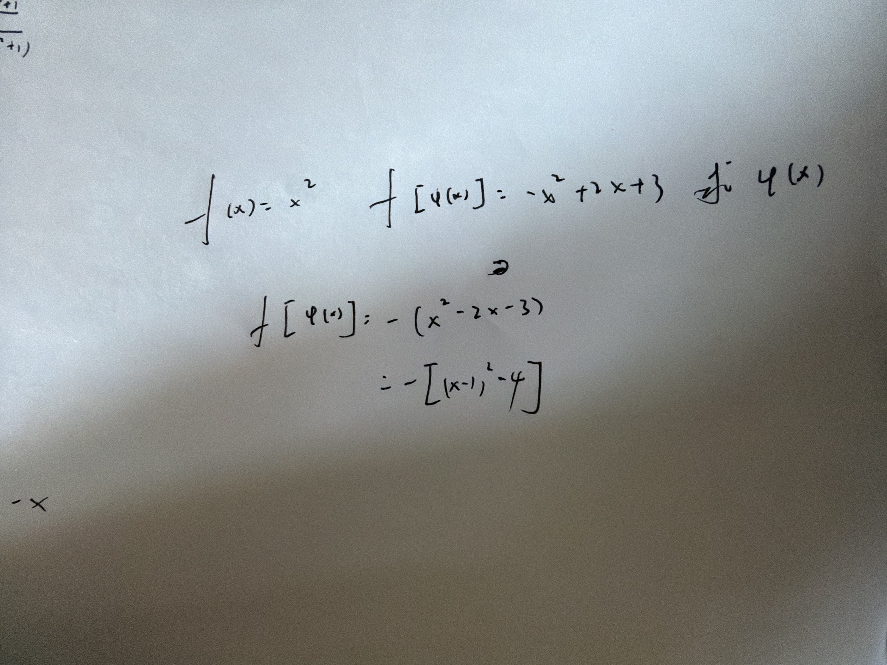

# 错题 01：复合函数代入与开平方

- 章节：函数与复合函数
- 日期：2026-10-01

## 原题及手写过程

已知 $f(x)=x^2$，$f[\varphi(x)]=-x^2+2x+3$，求 $\varphi(x)$。

## 四行法
1. **病根**：概念没懂——复合函数的输入替换。
2. **错在哪一步**：图片中的配方正确，但尚未完成求解；需要先明确 $f[\varphi(x)]=[\varphi(x)]^2$，不能把它直接当成 $\varphi(x)$。
3. **正确思路**：$[\varphi(x)]^2=-x^2+2x+3=4-(x-1)^2$。因此每个允许的 $x$ 上，$\varphi(x)$ 可取 $\pm\sqrt{4-(x-1)^2}$；实数范围要求 $4-(x-1)^2\ge0$，即 $x\in[-1,3]$。
4. **一句话提醒**：输入换成谁，就把谁整个平方；开平方别漏正负，根号内别忘非负。

## 严谨补充
未给正负、连续性等附加条件时，不能唯一确定这个函数。正根分支、负根分支都满足；也可在不同 x 处选择不同符号，但每个 x 只能选定一个值。[-1,3] 是最大允许定义域，若题目另给子区间则以题设为准。
