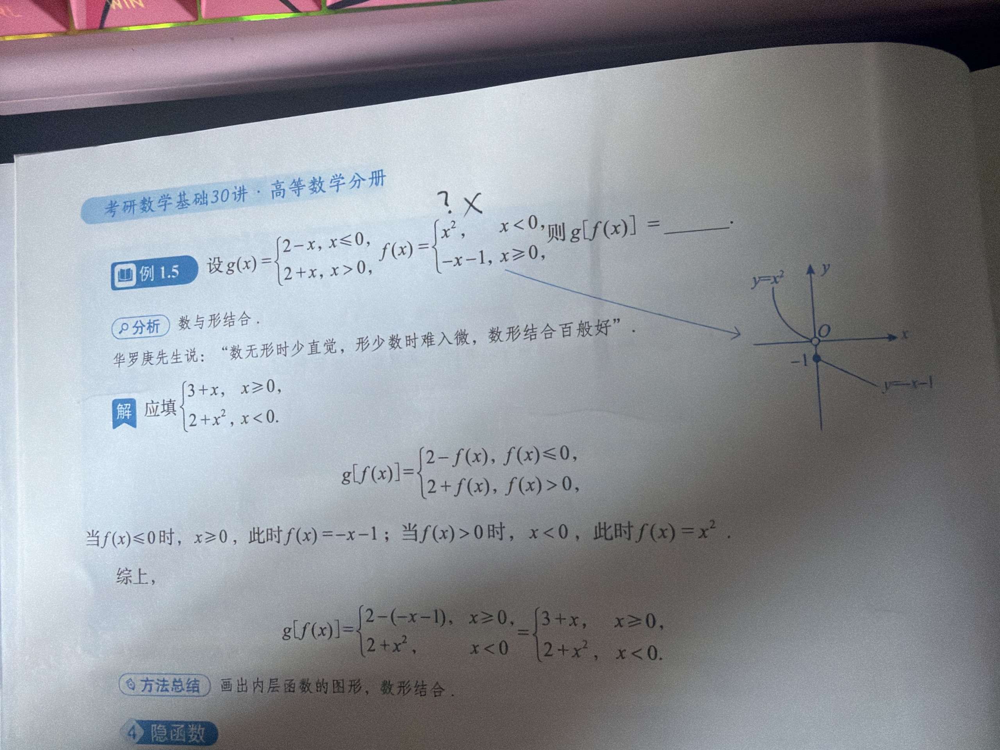

# 错题 02：分段函数复合与内外层分段点

- 章节：函数与复合函数
- 日期：2026-10-02
- 来源：李伟《高等数学》第二版 · 考研数学基础30讲 · 例 1.5

## 原题及手写过程

设 $g(x)=\begin{cases}2-x, & x\le 0\\ 2+x, & x>0\end{cases}$，$f(x)=\begin{cases}x^2, & x<0\\ -x-1, & x\ge 0\end{cases}$，求 $g[f(x)]$。

## 四行法

1. **病根**：概念没懂——把外层函数 $g$ 的分段条件「$f(x)\le 0$ 还是 $>0$」错当成「$x\le 0$ 还是 $>0$」来用。

2. **错在哪一步**：直接用 $x$ 的正负去选 $g$ 的哪一支，跳过了「先判断内层函数值的正负」这一步。书上那句「当 $f(x)\le 0$ 时 $x\ge 0$」是**解不等式解出来的**，不是一眼看出来的。

3. **正确思路**：外层 $g$ 的判定对象是**整个输入 $f(x)$**，所以先定 $f(x)$ 的符号：
   - $x<0$ 时 $f(x)=x^2>0$ → 走 $g$ 的 $>0$ 支：$g=2+f(x)=2+x^2$
   - $x\ge 0$ 时 $f(x)=-x-1\le -1<0$ → 走 $g$ 的 $\le 0$ 支：$g=2-f(x)=3+x$
   - 综上 $g[f(x)]=\begin{cases}3+x, & x\ge 0\\ 2+x^2, & x<0\end{cases}$

4. **一句话提醒**：判定分段，先问「内层那坨的**值域**在哪一段」，别手贱看自变量 $x$。

## 数形结合（书上的方法）

$f$ 的图像 = 抛物线 $y=x^2$ 的 $x<0$ 那半边（整段在 $x$ 轴上方）+ 射线 $y=-x-1$（$x\ge0$，从 $(0,-1)$ 向右下，整段在 $x$ 轴下方）。
**内层图像在 $x$ 轴上方 → 喂给 $g$ 的是正输入；在下方 → 负输入。** 看图秒定分段，硬解不等式属于给自己上强度。

## 变式

设 $g(x)=\begin{cases}2-x, & x\le 0\\ 2+x, & x>0\end{cases}$，$f(x)=x^2-4$，求 $g[f(x)]$。
（提示：$f(x)\le0 \iff x\in[-2,2]$，分界点是 $x=\pm2$，不是 $x=0$。）

minis_url: minis://workspace/vault/%E9%94%99%E9%A2%98%E5%BA%93/%E9%AB%98%E6%95%B0/%E9%94%99%E9%A2%9802_%E5%88%86%E6%AE%B5%E5%87%BD%E6%95%B0%E5%A4%8D%E5%90%88%E4%B8%8E%E5%86%85%E5%A4%96%E5%B1%82%E5%88%86%E6%AE%B5%E7%82%B9.md
